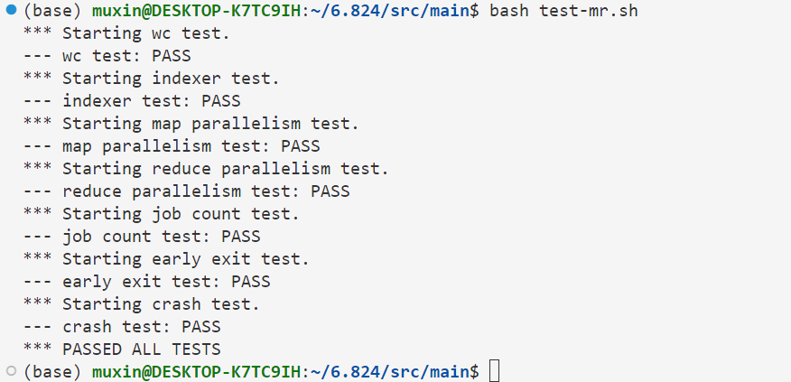
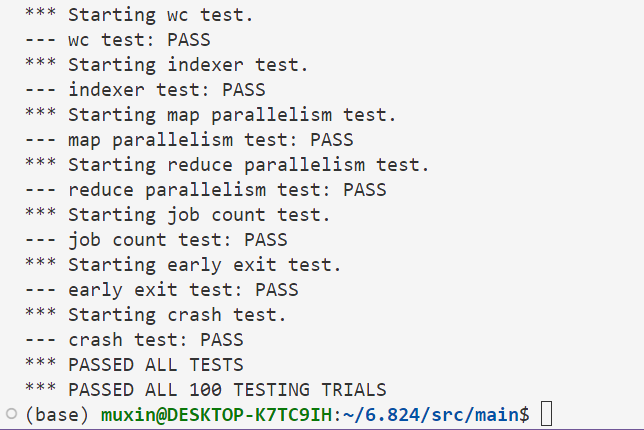

# lab1 MapReduce
## 任务描述
MapReduce:

在google 2008年的论文 **MapReduce: Simplified Data Processing on Large Clusters** 中提出了一种编程模型用于分布式地处理大型数据集。

简单来说，现实中的大部分任务都可以被表达为一个MapReduce模型，用户指定一个map函数，该函数可以将输入转化成一组键值对来作为中间结果，之后再指定一个reduce函数，将所有具有相同键的中间结果一起传递给该函数，reduce函数负责组合中间结果并生成最终的结果。

本lab需要实现一个分布式的MapReduce，来对文档库进行单词计数。MapReduce由两个程序组成，一个是coordinator，另一个是worker，前者负责任务的分发，后者负责真正的任务。而woker又分为map worker和reduce woker，前者负责map，后者负责reduce，coordinator需要协调好任务的分配。

## 思路描述

整个实验需要解决的几个问题如下：

1) map函数和reduce函数在该任务中具体代表了什么
2) worker如何向coordinator请求任务，coorinator又该如何分发任务
3) coordinator何时向worker分发map任务，又何时分发reduce任务，并且如何指定参数
4) worker如何通知coordinator任务完成情况
5) 整个过程是否存在race，如何解决
6) 如何处理worker的crash

对于问题1，本任务中的map和reduce都是比较简洁的。map函数负责将文本内容切片成单词，对于每一个单词*w*返回一个 *{w:'1'}* 的键值对。reduce函数接受key为*w*对应的所有value组成的数组，统计数组的长度，即为*w*出现的次数。lab的框架代码中已经给出了对应的实现。

对于问题2，worker通过RPC向coordinator进行请求任务，coordinator会开启RPC的server，接受到请求将分配的任务作为reply回送给worker。

对于问题3，整体思路是，必须所有的map任务完成后，才能开始reduce任务。因此，当worker请求任务是，如果map尚未完成则分配map任务，只有当所有map都完成后，才会分配reduce任务。coordinator会根据当前剩余的任务选择一个分配给worker，并将对应的参数写进RPC的reply中。

对于问题4，同样使用RPC的方法来通知，coordinator会开启一个接受通知的RPC，当worker完成任务时，调用该RPC来通知coordinator任务完成情况。

对于问题5，go语言中的RPC会在被调用时开启一个新的go程来执行，因此，当多个worker同时请求任务或者通知任务完成时，可能会对coordinator中的某些数据产生race。一个简单的办法是为coordinator设置一个互斥锁，当需要读取或修改coordinator中的数据时，先获取锁。

对于问题6，解决方法是，在分发任务时，coordinator记录下任务开始时间，当任务执行超过一定时间后worker还未通知完成时，认为该worker crash，将该任务分配给其他woker。

## 代码实现

### Coordinator

首先需要为Coordinator结构体添加一些字段来维护一些必要信息，主要是是为了维护当前任务完成情况，方便对woker进行任务分配。
```go
type Coordinator struct {
	// Your definitions here.
	nReduce            int          // the reduce task num
	inputFiles         []string     // the input files name
	mapTasks           []MapTask    // the map tasks
	mapFinish          bool         // is all the map tasks finished
	mapFinishedTask    int          // finished map tasks num
	reduceTasks        []ReduceTask // the reduce tasks
	reduceFinish       bool         //is all the reduce tasks finished
	reduceFinishedTask int          // finished reduce tasks num
	lock               sync.Mutex   // the mutex lock
}
```
其中MapTask和ReduceTask结构体用于描述一个Map任务和Reduce任务当前的状态，定义如下：

```go
const (
	toDo  = 0
	doing = 1
	done  = 2
)

type MapTask struct {
	state     int
	startTime time.Time
}
type ReduceTask struct {
	state     int
	startTime time.Time
}
```

具体而言，每个任务有三个状态，toDo：还未分配出去，doing：任务已经分配出去但是还未通知完成，done：任务已经完成，worker已经通知。同时，当任务分配出去时，需要记录任务开始的时间。

Coordinator的初始化过程如下：

```go
func MakeCoordinator(files []string, nReduce int) *Coordinator {
	c := Coordinator{}
	c.inputFiles = files  
	c.mapTasks = make([]MapTask, len(c.inputFiles)) // map tasks num = inputFiles num
	c.nReduce = nReduce
	c.reduceTasks = make([]ReduceTask, nReduce) // reduce tasks num = nReduce

	c.server()
	return &c
}
```

接着为Coordinator定义分配任务的RPC RequestTask，首先在rpc.go文件中定义该RPC的args和reply：
```go
type RequestTaskArgs struct {
}
// request task state
const (
	success = 0
	wait    = 1
	finish  = 2
)

type RequestTaskReply struct {
	State     int
	TaskType  string
	InputFile string
	Id        int
	MapperNum int
}
```
该RPC并不需要传递实际args，而reply则较为复杂。woker调用该RPC可能有三种结果，一种是Coordinator立即分配了一个任务，对应State为success，另一种情况是还有任务未完成但是无法立即分配出去，需要等待，对应State为wait，最后一种情况是所有任务都完成了，对应State为finish。当State为success，需要将任务的参数填入到reply的其他字段。

实现RequestTask：
```go
func (c *Coordinator) RequestTask(args *RequestTaskArgs, reply *RequestTaskReply) error {
	c.lock.Lock()
	defer c.lock.Unlock()
	if !c.mapFinish {
		findTask := false
		for i, task := range c.mapTasks {
			if task.state == toDo {
				reply.InputFile = c.inputFiles[i]
				reply.Id = i
				c.mapTasks[i].state = doing
				c.mapTasks[i].startTime = time.Now()
				findTask = true
				break
			} else if task.state == doing {
				now := time.Now()
				diff := now.Sub(task.startTime)
				if diff > 10*time.Second {
					// crash
					reply.InputFile = c.inputFiles[i]
					reply.Id = i
					c.mapTasks[i].startTime = now
					findTask = true
					break
				}
			}
		}
		if !findTask {
			reply.State = wait
		} else {
			reply.State = success
			reply.TaskType = "Map"
		}
	} else if !c.reduceFinish {
		findTask := false
		for i, task := range c.reduceTasks {
			if task.state == toDo {
				reply.Id = i
				c.reduceTasks[i].state = doing
				c.reduceTasks[i].startTime = time.Now()
				findTask = true
				break
			} else if task.state == doing {
				now := time.Now()
				diff := now.Sub(task.startTime)
				if diff > 10*time.Second {
					// crash
					reply.Id = i
					c.reduceTasks[i].startTime = now
					findTask = true
					break
				}
			}
		}
		if !findTask {
			reply.State = wait
		} else {
			reply.State = success
			reply.TaskType = "Reduce"
			reply.MapperNum = len(c.inputFiles)
		}
	} else if c.reduceFinish {
		reply.State = finish
	}
	return nil
}
```

整个分配任务的思路比较简单，当c.mapFinish为false时，说明map任务还未完成，此时，遍历c.mapTasks，对于每一个mapTask，当state为toDo时，则直接分配该任务，并记录任务开始时间并退出遍历，当state为doing时，需要检查当前时间和该任务的开始时间，如果相差超过10s，则认为之前领取该任务的woker crash了，将该任务重新分配给当前请求的woker，将任务的相关参数写入到reply中，并修改任务开始时间。当遍历完所有的mapTask仍没有可以分配的任务时，则reply的State为wait，否则为success。

当c.mapFinish为true，但是c.reduceFinish为false，则说明map任务完成，但是reduce任务未完成，此时，同理，遍历c.reduceTasks，寻找一个可分配的任务，与上面类似。

当c.reduceFinish为true时，说明所有任务都已完成，则直接将reply.State置为finish。

需要注意的是，RequestTask需要对Coordinator中多个字段进行访问和修改，因此在函数开始前先获取互斥锁，函数执行完成后释放锁。

还需要为Coordinator定义一个通知任务完成的RPC InotifyFinish，同样，先在rpc.go文件中定义该RPC的args和reply：
```go
type InotifyFinishArgs struct {
	TaskType string
	Id       int
}
type InotifyFinishReply struct {
	Success bool
}
```
args需要传递TaskType来说明是哪种任务完成了，同时需要传递任务在该种任务中对应的Id，reply则仅仅返回该通知是否成功。

InotifyFinish的实现：

```go
func (c *Coordinator) InotifyFinish(args *InotifyFinishArgs, reply *InotifyFinishReply) error {
	c.lock.Lock()
	defer c.lock.Unlock()
	if args.TaskType == "Map" {
		if c.mapTasks[args.Id].state == doing {
			c.mapTasks[args.Id].state = done
			c.mapFinishedTask++
			if c.mapFinishedTask == len(c.inputFiles) {
				c.mapFinish = true
			}
			reply.Success = true
		} else {
			reply.Success = false
		}
	} else if args.TaskType == "Reduce" {
		if c.reduceTasks[args.Id].state == doing {
			c.reduceTasks[args.Id].state = done
			c.reduceFinishedTask++
			if c.reduceFinishedTask == c.nReduce {
				c.reduceFinish = true
			}
			reply.Success = true
		} else {
			reply.Success = false
		}
	}
	return nil
}
```

InotifyFinish根据args中的TaskType和Id来将c.mapTasks[args.Id].state或者c.reduceTasks[args.Id].state置为done，并且增加c.mapFinishedTask或者c.reduceFinishedTask，当对应种类的任务全部完成时，修改c.mapFinish或者c.reduceFinish。

还需要为Coordinator完善Done函数，来判断整个任务是否完成：
```go
func (c *Coordinator) Done() bool {
	ret := false
	c.lock.Lock()
	defer c.lock.Unlock()
	// Your code here.
	if c.reduceFinish {
		ret = true
	}

	return ret
}
```
当c.reduceFinish为true，则说明所有的任务都已经完成，返回true，否则返回false。

### Woker

Woker中需要先定义两个Call函数，来调用Coordinator中的两个RPC：
```go
func CallRequestTask() RequestTaskReply {
	args := RequestTaskArgs{}

	reply := RequestTaskReply{}

	ok := call("Coordinator.RequestTask", &args, &reply)
	if !ok {
		fmt.Printf("call RequestTask failed!\n")
	}
	return reply
}

func CallInotifyFinish(taskType string, Id int) InotifyFinishReply {
	args := InotifyFinishArgs{}

	args.TaskType = taskType
	args.Id = Id

	reply := InotifyFinishReply{}

	ok := call("Coordinator.InotifyFinish", &args, &reply)
	if !ok {
		fmt.Printf("call InotifyFinish failed!\n")
	}
	return reply
}
```
完善Woker的主体函数Worker：
```go
func Worker(mapf func(string, string) []KeyValue,
	reducef func(string, []string) string) {

	// Your worker implementation here.
	for {
		reply := CallRequestTask()
		if reply.State == wait {
			time.Sleep(time.Second)
			continue
		} else if reply.State == success {
			if reply.TaskType == "Map" {
				MapWorker(reply.InputFile, reply.Id, mapf)
			} else if reply.TaskType == "Reduce" {
				ReduceWorker(reply.MapperNum, reply.Id, reducef)
			}
		} else if reply.State == finish {
			break
		}
	}
}
```
该函数的主体是一个for循环，Worker在不断地通过CallRequestTask向Coordinator请求任务，并根据reply采取不同动作。当reply.State为wait时，说明暂时没有任务可分配，则sleep一秒后继续请求；reply.State为finish，则说明所有任务都已完成，直接退出循环结束函数；当reply.State为success，则说明成功领取任务，根据reply.TaskType来执行MapWoker和ReduceWorker函数进行真正的工作。

MapWorker实现：
```go
func MapWorker(inputfile string, workerId int, mapf func(string, string) []KeyValue) {
	file, err := os.Open(inputfile)
	if err != nil {
		log.Fatalf("cannot open %v", inputfile)
	}
	content, err := ioutil.ReadAll(file)
	if err != nil {
		log.Fatalf("cannot read %v", inputfile)
	}
	file.Close()
	intermediate := mapf(inputfile, string(content))

	ofiles := make([]*os.File, nReduce)
	for i := 0; i < nReduce; i++ {
		ofiles[i], _ = ioutil.TempFile("", "mr")
		defer ofiles[i].Close()
	}
	encs := make([]*json.Encoder, nReduce)
	for i := 0; i < nReduce; i++ {
		encs[i] = json.NewEncoder(ofiles[i])
	}

	for _, kv := range intermediate {
		i := ihash(kv.Key) % nReduce
		encs[i].Encode(&kv)
	}
	// rename temp file
	currentDir, _ := os.Getwd()
	for i := 0; i < nReduce; i++ {
		targetFileName := "mr-" + strconv.Itoa(workerId) + "-" + strconv.Itoa(i)
		targetFilePath := filepath.Join(currentDir, targetFileName)
		os.Rename(ofiles[i].Name(), targetFilePath)
	}
	CallInotifyFinish("Map", workerId)
	// reply := CallInotifyFinish("Map", workerId)
	// fmt.Printf("map worker %d inotify finish %v\n", workerId, reply.Success)
}

```

MapWorker接受三个参数，inputfile为输入文件的文件路径，workerId为该map任务对应的id，mapf为map函数。

首先读取inputfile的内容content，接着将content传入到mapf来获取中间结果，中间结果是一个{w:'1'}样式键值对的数组，我们需要根据key来将这些键值对写入到不同的中间结果文件中。具体的分配方法是，对key计算一个哈希值，再将该哈希值对nReduce取模，这样可以使得所有的键值对分配到nReduce个中间结果文件中。

写入中间结果文件时，使用了encoding/json包以json形式写入了键值对方便后面读取，同时为了避免woker在crash时没有人观察到部分写入的文件，我们采取了临时文件的技巧，先在临时文件中写入，当所有写入完成后，对临时文件rename，将文件名设置成中间结果文件的格式 "mr-X-Y"。

在完成所有工作后，MapWorker调用CallInotifyFinish来通知Coordinator该map任务已经完成。

ReduceWorker实现：
```go
func ReduceWorker(mapperNum int, workerId int, reducef func(string, []string) string) {
	intermediate := []KeyValue{}
	for i := 0; i < mapperNum; i++ {
		fileName := "mr-" + strconv.Itoa(i) + "-" + strconv.Itoa(workerId)
		file, _ := os.Open(fileName)
		defer file.Close()
		dec := json.NewDecoder(file)
		for {
			var kv KeyValue
			if err := dec.Decode(&kv); err != nil {
				break
			}
			intermediate = append(intermediate, kv)
		}
	}
	sort.Sort(ByKey(intermediate))
	oname := "mr-out-" + strconv.Itoa(workerId)
	ofile, _ := os.Create(oname)
	i := 0
	for i < len(intermediate) {
		j := i + 1
		for j < len(intermediate) && intermediate[j].Key == intermediate[i].Key {
			j++
		}
		values := []string{}
		for k := i; k < j; k++ {
			values = append(values, intermediate[k].Value)
		}
		output := reducef(intermediate[i].Key, values)

		// this is the correct format for each line of Reduce output.
		fmt.Fprintf(ofile, "%v %v\n", intermediate[i].Key, output)

		i = j
	}
	ofile.Close()
	CallInotifyFinish("Reduce", workerId)
	// reply := CallInotifyFinish("Reduce", workerId)
	// fmt.Printf("reduce worker %d inotify finish %v\n", workerId, reply.Success)
}
```

ReduceWoker接受三个参数，mapperNum代表mapper的个数，也代表每个reducer需要汇总这么多个中间结果文件；wokerId代表该reducer的Id，reducef是reduce函数。

首先，ReduceWoker将所有"mr-X-Id"的中间结果文件中的键值对都读取出来，放入一个数组中，之后对所有键值对进行排序，让所有具有相同key的键值对挨在一起，之后遍历数组，将具有相同key值的键值对切片出来，输入reducef获取该key最终的计数结果，并写入到输出文件中。此处代码参考mrsequential.go。

在完成所有工作后，调用CallInotifyFinish来通知Coordinator该reduce任务已经完成。

## TEST

1次test的结果：



100次test的结果：



