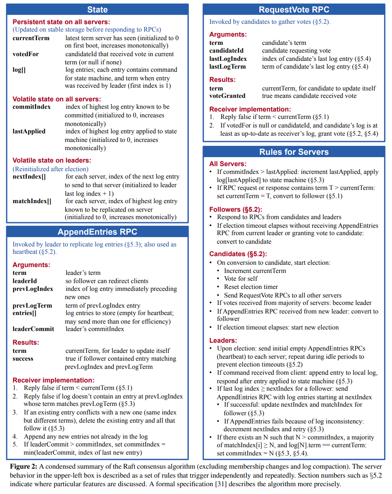
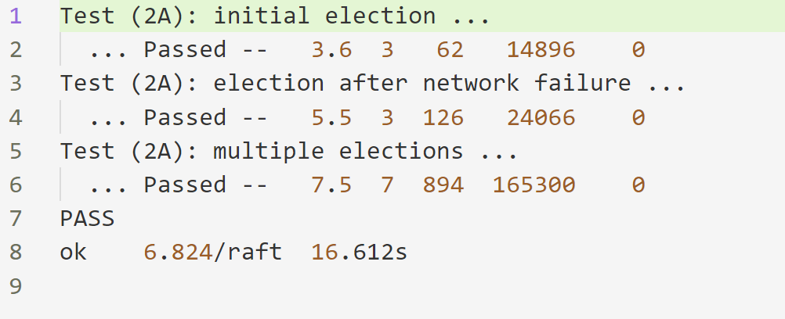
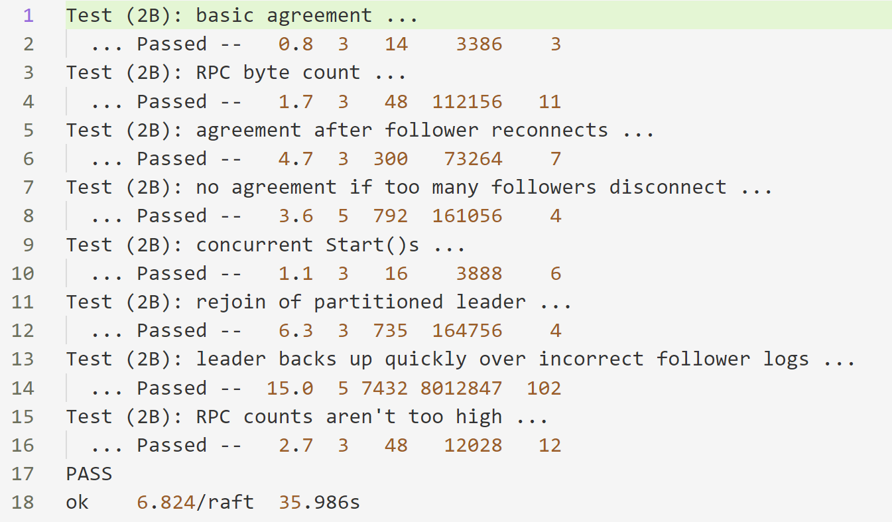
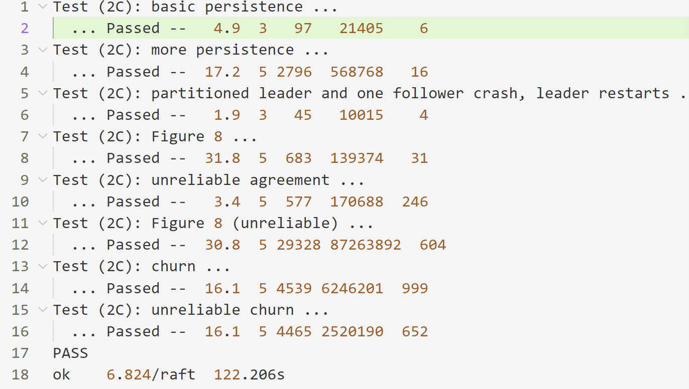
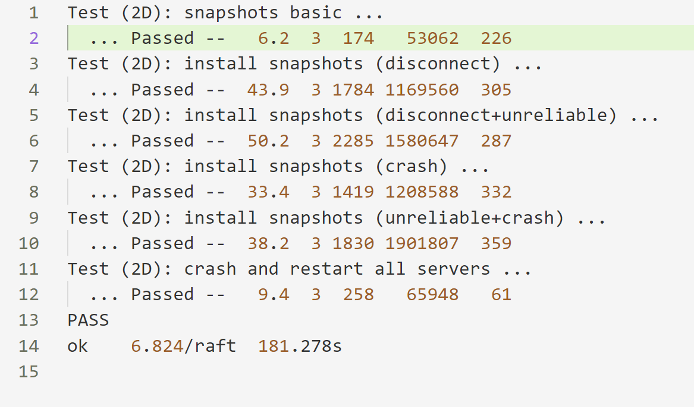
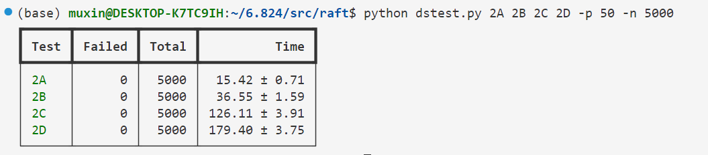

# lab2 Raft

lab2 需要实现raft协议，Raft是一种用于管理复制日志的共识（consensus）算法。共识算法出现在复制状态机的背景下：一组服务器上的状态机计算相同状态的相同副本，并且即使某些服务器发生故障也可以继续运行，用于解决分布式系统中的各种容错问题。

复制状态机通常使用复制日志来实现。每个服务器都存储一个包含一系列命令的日志，其状态机按顺序执行这些命令。每个日志包含相同顺序的相同命令，因此每个状态机处理相同的命令序列。由于状态机是确定性的，因此每个状态机都计算相同的状态和相同的输出序列。

Raft负责管理这些日志，确保所有副本服务器看到相同的日志，并且按照相同的顺序执行这些日志，当服务器发生故障但后来回复，Raft会负责更新日志。只要至少大多数服务器处于活动状态并且可以相互通信，Raft 就会继续运行。如果没有这样的多数，Raft 将不会取得任何进展，但一旦多数可以再次通信，Raft 就会从上次中断的地方继续。

想要在直观上很好的理解raft算法，可以参照该网站对raft算法的可视化动画：[链接](http://thesecretlivesofdata.com/raft/)，这些动画很好的展示了raft算法的各个环节。

而要实现raft算法，那么需要完整地参照这篇论文 [In Search of an Understandable Consensus Algorithm (Extended Version)](http://nil.csail.mit.edu/6.824/2022/papers/raft-extended.pdf),关于raft实现过程中的所有细节都在论文中有所体现，raft算法的主要逻辑被涵盖在了论文中的[图2](#figure-2)，这也是实现本lab最重要的参考内容。另外，mit的助教为本lab写了一个[student guide](https://thesquareplanet.com/blog/students-guide-to-raft/)，在该文中，为论文中一些粗略带过的细节进行了一些补充，也介绍了一些学生在实现过程中容易出现的一些bug，也是很有用的参考资料。

本lab将整个raft的实现分为了四个部分，每一个部分实现raft的不同功能。

## Part 2A: leader election
2A需要实现raft的leader选举功能。

raft中，所有的server可能的身份有三种：leader，candidate，follower，在初始阶段，所有server的身份都为follower，当超过一段时间follower仍然没有接受到leader的心跳（也就是election timeout），那么该follower会变成candidate开始竞选，当一个follwer得到超过半数的投票时，它被选举为leader，在没有故障的前提下，该leader会一直担任并且向其他所有的follower发送心跳，来阻止别的follower的election timeout。当leader故障时，某个follower的election timeout到达时，开始新一轮的选举。

整个选举过程涉及到两个RPC，RequestVote和AppendEntries，当一个candidate开始进行竞选时，它会向所有的其他peer发送RequestVote RPC来获取选票，而当它当选leader后，则会周期性的发送AppendEntries RPC来像其他follower发送心跳。两个RPC的args和reply以及对应的handle逻辑在论文图2中已经详细说明，所有的逻辑处理需要严格按照图二的描述进行。

### 容易出错的细节

两个RPC的args和reply中都有Term字段，args中的Term表示请求方请求时的currentTerm，reply中的Term表示应答方应答时的currentTerm，图二中详细介绍了当args.Term与应答方的currentTerm为不同关系时，该如何处理，但是并未详细提及reply.Term该如何使用。

[student guide](https://thesquareplanet.com/blog/students-guide-to-raft/)则提到了该情况，最为简易的处理办法是，当reply.Term和RPC的args.Term或currentTerm不一致时，就应该将RPC的回复丢弃。

该做法是否有必要?

**非常有必要！**

考虑这样一种情况，在网络非常不可靠的情况下，所有RPC都有可能是乱序的，有三个server0,1,2，在Term n, server 0和1同时开始了竞选，此时，0和1都投票给自己，server2投票给了0，此时server 0有两票当选，而此时，server2在Term n-m对server1的投票结果经过很长的网络延迟到达了server1并且同意投票，如果不对reply.Term进行判断，那么server1会将这一票当做是Term n的票，此时，server1也有两票，也当选leader，那么在Term n就有两个leader，这是严重的错误。而如果对reply.Term进行判断，会发现reply.Term和currentTerm不一致，就会丢弃掉这一票，避免错误的发生。（这是在2C的测试中发生的一个真实案例，由于2A部分的测试比较弱，很多2A部分的错误会在后面的测试才暴露出来）。

## Part 2B: log
2B需要是实现Raft的日志功能，当客户端向服务器发送了新的命令，leader需要将该命令添加到日志中，并且向所有的follower通过AppendEntries RPC发送新的日志，当leader发现多数的server都已经拥有该日志，则会将该日志通过applyCh管道提交给真正的service，状态机根据该命令转移状态。

AppendEntires RPC的处理逻辑需要严格按照图2的说明，需要给leader开两个常驻的线程，一个用来根据所有follower的matchIndex来更新commitIndex，另一个线程则用来根据每个follower的nextIndex来为该follower来发送新的log。还需要为每一个server开一个常驻的线程用来apply，根据当前lastApplied和commitIndex来将新提交的log发送到applyCh管道。

### 容易出错的细节
#### bug1

在2B发生的一个bug是由于go的切片机制，在AppendEntries RPC的args中需要提供新增的logs，刚开始时，直接对rf.logs进行切片然后赋给了args中的entires字段。

在测试中，发现出现了data race，一开始不知道是哪个变量发生了race，检查了一下感觉每个函数前都加了锁啊，后来发现由于go的切片在底层是共享数组的，把rf.logs的一部分赋值给了args，对rf.logs的所有操作都是在获得锁后进行的，但是在RPC过程中是不能持有锁的，因此，在对args进行读取时是可能在它与rf.logs共享的底层数组上存在data race的。修改也很简单，只要在对args的entries字段进行赋值时使用复制的方式进行就可以了。

#### bug2
第二个bug是发生在apply中，前面说到，每个server会开一个常驻的线程来将新增的log发送到applyCh，这个线程是一个死循环，为了避免一直空轮，每次工作后会睡眠10ms，再进行下一轮工作。在最开始的代码里，apply每一轮只会将一个log发送到applyCh，然后就开始睡眠。由于AppendEntries在发送log时是会一次发多个的，如果apply一次只发送一个log，然后就睡眠，会导致新增的log不能很快的全部发送到管道，导致一些测试不能再规定的时间里达到agreement。修改也很简单，apply每次循环将所有的已提交的log都发送到applyCh后再去睡眠。

## Part 2C: persistence
2C需要实现raft的持久化，raft中的server可能会由于各种原因重启，当一个server重启时，它应该恢复到中断时候的状态，因此，server必须实时的保存一些需要持久化的数据，关于需要持久化的一些数据，在图二中已经标明，在对这些数据进行每一次修改后，都应该及时调用persist()函数来将当前状态写入磁盘中。在server重启时会通过readPersist()函数来从磁盘中读取状态。

2C基本不会引入新的bug，只要2A和2B的逻辑没有问题，再添加持久化机制2C的测试基本都能过，但是2C的测试会比2A和2B的要求更高，因此可能2A和2B的错误会在2C的错误中暴露出来。

## Part 2D: log compaction 
2D需要实现raft的日志压缩。

每个server的log都会一直增长，不能无限制的存储所有的log，因此需要快照机制，上层服务不时的为当前的状态机形成快照，此时server就可以将之前的log丢弃，快照也需要进行持久化，这样server在重启时就可以根据快照进行恢复。一些follower可能落后于leader太多，导致leader已经没有follower需要的log，此时leader需要通过InstallSnapshot RPC来将最新的快照发送给follower。

因此过时的log会被丢弃，因此每个server的logs的index并不一定从0开始了，因此，需要更改logs的索引机制。

我们为每个Raft实例添加一个成员变量logsStartIndex，用来记录当前的rf.logs对应的第一个log entry的实际index，当需要访问第i个log entry时实际访问的是rf.logs[i-rf.logsStartIndex]（如果此时的logs中还包含该log entry）。当形成新的快照时，丢弃掉一些过时log后需要更新logsStartIndex。

此外，还需要为Raft实例添加两个变量	lastIncludedIndex，lastIncludedTerm，用来记录最新快照对应的最后一个log的index和term，记录这个信息是为了在AppendEntries新log时有可能需要验证前一个log是否match。

需要注意的是添加的三个新的成员变量都是需要持久化的，因此当这三个变量修改时需要进行persist，server重启时也需要读取这三个变量。

### 容易出错的细节

在2D非常容易出现的一个bug是由于在applyCh进行写入时持有锁引起的一个死锁问题。

在整个raft中，需要对applyCh进行写入的地方有两个，一个是apply新的命令时需要通过将命令写入到applyCh管道中，传递给上层服务；另一处是follower收到leader发送的最新快照，将该快照写入到applyCh管道中，传递给上层服务。

在最开始的代码中，所有对applyCh的写入前都已经获取了Raft实例的锁，但是并未产生死锁现象。在加入快照机制后，则会产生奇怪的死锁现象。

仔细分析死锁产生的原因：
当Raft实例有多个待apply的log，apply函数获取到了锁，并且开始向applyCh管道中写入命令，当写入某个命令后，此时上层服务还未来得及读取该命令，而是恰好准备好了快照并且希望raft实例能够截断log，因此去调用Snapshot函数去进行相应的处理，该函数执行前是需要获取锁的，但是，需要注意的是之前apply函数还在写入新的命令，但是由于管道中的命令还未被上层服务读取，因此写入被阻塞住了，因此锁一直未释放，所有产生了死锁。

也就是：

Raft -> apply() -> **lock()** -> (newLog 写入 applyCh)(阻塞)

上层服务 -> Snapshot() -> **lock()**

那么为什么之前不会死锁呢，因为之前raft提交的新命令都会很快被上层服务读取，因此applyCh的写入不会阻塞，因此不会死锁。

解决办法很简单，就是在对applyCh进行写入时暂时放弃掉锁，在写入完成后再重新获取锁，这样就不会产生死锁。
## Test

### 单次测试

2A

2B

2C

2D

### 多次测试
使用脚本对2A到2D的所有用例测试5000次，每次并行50个测试，所有测试均成功

