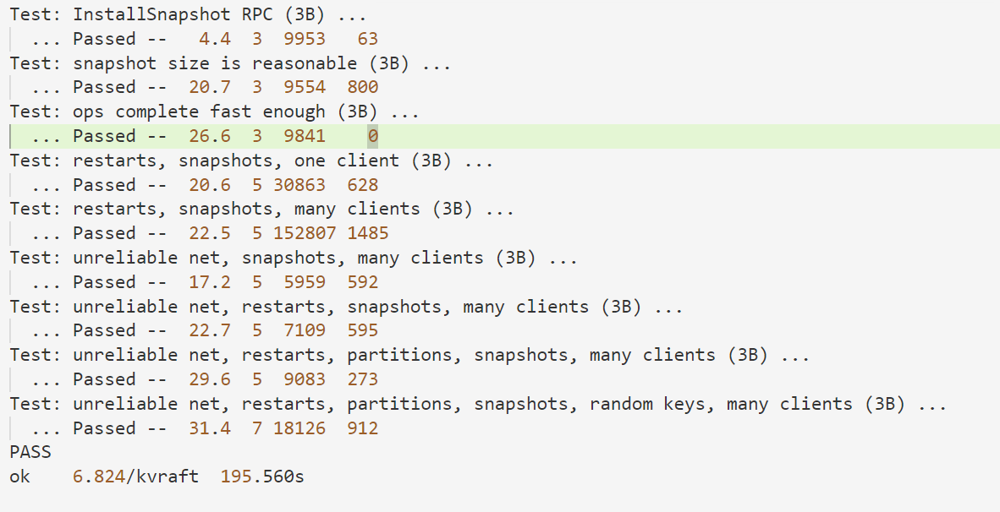

# lab3 Fault-tolerant Key/Value Service
lab3中，需要使用lab2中的raft来搭建容错 key/value 存储服务。key/value 存储服务将是一个复制状态机，由多个使用raft进行复制的kvServer组成。
只要大多数kvServer可用，那么整个key/value存储服务就是可用的，可以继续处理客户端的请求。

会有多个client向kvServer发起请求，一共有三种请求，Put(key, value), Append(key, arg), 和 Get(key)，Put设置key对应的value，Append在key对应的value后进行追加，Get获取key对应的value。

key/value存储服务必须满足Put，Append，Get三种方法调用的可线性化，可线性化指的是所有客户端的请求调用表现的就像系统只有一个副本，并且后面的调用应该观察到前面调用所导致的系统状态修改。

想要在复制状态机上保证调用的可线性化，就必须借助于raft，raft保证所有的命令在每个状态机上按顺序执行，并且只有命令在大部分状态机上达成一致后才会被提交。

lab3分为两个部分，lab3A使用raft实现key/value服务，但是不使用快照，lab3B添加快照功能，使得raft可以丢弃过时log。

## Part A:Key/value service without snapshots
Part A首先需要实现client端，client的实现是比较简单的，每个client借助于对应的Clerk来向kvServer发送三种请求的RPC，并返回对应请求的返回值。

client在发送请求时，可能并不知道谁才是kvServer中的leader，因此，在client请求失败后会换下一个kvServer进行发送请求，直到找到真正的leader。因此，为了减少寻找的时间，client在每次找到真正leader后会记录下来leader对应的kvServer的id，下一次请求会直接向该kvServer发送，直到请求失败。

需要注意的是，可能会有多个client在同时向kvServer请求，**因此，kvServer必须唯一标识每一个client，这里的解决方法是为每一个client生成一个大的随机数来作为对应的Id**，client在发送请求时会发送自己的Id作为标识。同时，为了保证client的每条请求只执行一次，**必须唯一标识client的每条请求，做法是为每个client的每条命令关联一个自增的命令Id**，在发送请求时一起发送。

然后是kvServer的实现，kvServer要保证所有请求调用的可线性化需要借助于raft，因此，每一个kvServer和一个rfServer关联，kvServer在接受到一个请求后，如果它不是leader，那么会直接返回RPC，并将Err置为ErrWrongLeader，如果是leader，那么在对应的RPC handler中将对应的命令使用rfServer的Start()方法提交到日志，之后等待rfServer中的多数达成共识后，rfServer会将对应的命令发送到applyCh，kvServer会有一个**applier goroutines** 在不断读取命令，读取后进行真正的执行，在命令执行完成后，返回对应请求的RPC。

kvServer的database就使用一个简单的map[string]string来实现，当执行Put和Append命令时，对map中key对应的value进行相应的操作，执行Get命令时，返回map中key对应的value。

kvServer在实现时有几个设计上的难点，第一个是kvServer在接受到一个请求后，需要等待rfServer将它提交并执行后才能返回该请求的RPC，如何实现这个过程中的同步。

这里的解决办法是，kvServer在Start()一个命令后会获取该命令在log中的索引，该索引是唯一的，因此，我们可以为每个kvServer维护一个map **notifyChs**，该map是一个log索引到channel的map，当我们Start()一个命令后，根据对应的log索引创建一个新的channel并添加到**notifyChs**中，该请求的RPC handler会在该channel上进行阻塞等待命令执行后的通知，而applier goroutines 会在执行完对应命令后，根据命令在log中的索引从**notifyChs**获取到该channel并写入通知。因此，当RPC handler在channel上读取到通知后，得知命令已经执行完毕，此时返回RPC，在RPC返回后，需要从**notifyChs**中删除对应的channel。

第二个难点是，当网络和服务器不可靠时，会出现这样一种情况，client向某个kvServer发送请求，该kvServer接收到请求时还未失去leader身份，因此没有返回ErrWrongLeader，该kvServer将该命令Start()，并根据log索引创建好channel等待通知，但之后它失去leader身份，因此该命令并未提交给其他rfServer，那么该请求的RPC handler 永远不会等到前一个channel的通知，client一直在等待RPC返回。

解决方法是为RPC handler添加**超时机制**，RPC handler依然在对应的channel上等待通知，**在等待一段时间后channel依然没有通知时，RPC返回ErrTimeOut**。这可以用go中的select语句搭配time.After()很简洁地实现。client在收到ErrTimeOut后换另一个kvServer进行请求。

第三个难点是，考虑这样一种情况，client向leader发送请求，在raft层，该命令已经达到共识，并且leader也已经执行，但在返回RPC之前崩溃，因此client端的RPC请求显示失败，因此会重新发送该命令到新的leader，再执行一次该命令，导致状态机的错误。

解决方法是为每个kvServer维护当前每个client的最后请求的Id，当client发送的信请求的Id小于等于该Id时不执行该Id。之前在client的实现中，已经为每个命令关联了一个自增的唯一Id，**因此只需要在kvServer中维护一个map lastCmdIds，key为client的Id，value为该client已经执行的最后一个命令的Id。**

### 出现的bug

#### bug1
bug1出现在这样的场景下，client向kvServer1发送命令A，kvServer1接收到请求时还未失去leader身份，将该命令Start()，并根据log索引i创建好channel等待通知，但之后它失去leader身份，并且log产生了回退，kvServer2当选leader，向kvServer1发送来了命令B，命令B在log中的索引同样为i，applier在执行命令B后根据索引i从**notifyChs**取出对应channel，发送通知，此时命令A对应的RPC handler还未超时，从channel中取出通知，误以为命令已完成，返回RPC，实际上命令A可能还未完成。

解决办法：导致上面bug的原因是，试图通过log索引来唯一标识一个命令，然而log可能会回退，**相同的log索引并不一定对应一个命令**，因此，我们在applier在向channel中写入通知时同时写入client Id和命令的Id，RPC handler在读取channel时，通过比较channel通知完成的命令和RPC请求的命令是否一致来判断RPC请求的命令是否正确执行完毕。

#### bug2
bug2是由于**notifyChs**中channel设置为**无缓冲区**而引起的一个死锁问题。

**notifyChs**中的channel的生命周期大致是这样的，在RPC handler的goroutine中：
```go
kv.mu.Lock()
if _, ok := kv.notifyChs[index]; !ok {
  kv.notifyChs[index] = make(chan CmdIdentify)
}
ch := kv.notifyChs[index]
kv.mu.Unlock()
select {
case cmdIdentify := <-ch:
  if cmdIdentify.ClientId == op.ClientId && cmdIdentify.CmdId == op.CmdId {
    err = OK
  } else {
    err = ErrWrongLeader
  }
case <-time.After(time.Duration(RPCTimeOut) * time.Millisecond):
  kv.mu.Lock()
  if kv.isRepeateCmd(op.ClientId, op.CmdId) {
    kv.mu.Unlock()
    err = OK
  } else {
    kv.mu.Unlock()
    err = ErrTimeOut
  }
}
kv.mu.Lock()
delete(kv.notifyChs, index)
kv.mu.Unlock()
```

在RPC handler的goroutine中，根据命令在log中的索引index创建新的channel并添加到**notifyChs**中，在创建好channel之后，会释放掉kvServer的锁，等待通知写入channel或者超时。在最后，重新获取锁，从**notifyChs**中删除channel。

而在applier goroutine中，在执行完index处的命令后，会尝试获取对应的channel并写入通知，如下：

```go
index := newApplyMsg.CommandIndex
kv.mu.Lock()
if ch, ok := kv.notifyChs[index]; ok {
  ch <- CmdIdentify{ClientId: op.ClientId, CmdId: op.CmdId}
}
kv.mu.Unlock()
```

那么，就可能存在这样一种情况，applier刚执行完一个命令，**获取了kvServer的锁**，并向对应的channel写入了通知，之后，**阻塞住等待RPC handler读取channel**。此时，恰好该命令对应的RPC handler超时了，**不再尝试读取channel，而是尝试获取锁并删除对应的channel**，两个goroutine形成了一个死锁。

这个死锁虽然是小概率发生的，但是多跑几次测试时一定会遇到的。

解决办法其实很简单，就是将channel设置成**带一个缓冲区**的channel，这样即使applier向channel写入通知后RPC恰好超时，applier也不会阻塞住，RPC handler依然可以顺利获取锁。

## Part B: Key/value service with snapshots
PartB需要为key/value 服务添加快照机制。kvServer在初始化时会接受一个参数maxraftstate，当kvServer关联的rfServer的状态的大小超过该参数，那么kvServer需要准备好快照并且调用rfServer的SnapShot()方法来保存快照并截断log。

该机制的实现其实较为简单，只需要在每个命令真正执行完毕后，检查当前rfServer的状态大小，超过阈值后需要准备快照，快照要保存的变量只有两个，**一个是作为database的key/value map；第二个则是lastCmdIds，该map记录了所有client执行的最后一个命令的Id**。将两个变量编码为字节后传递给rfServer的SnapShot()方法，raft层负责快照的持久化。

在kvServer重启后，如果存在快照，那么需要根据快照来恢复kvServer的状态。当kvServer从raft层获取到一个别的rfServer发送过来的快照时，kvServer也需要根据该快照来更新kvServer的状态。

## Test

### 单次测试

3A


3B



### 多次测试
使用脚本对3A和3B的所有用例测试5000次，每次并行50个测试，所有测试均成功

