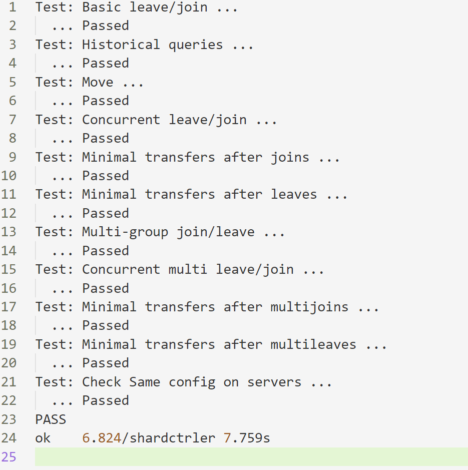
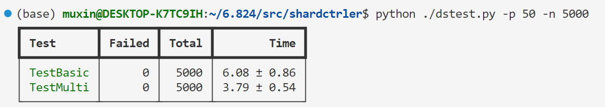
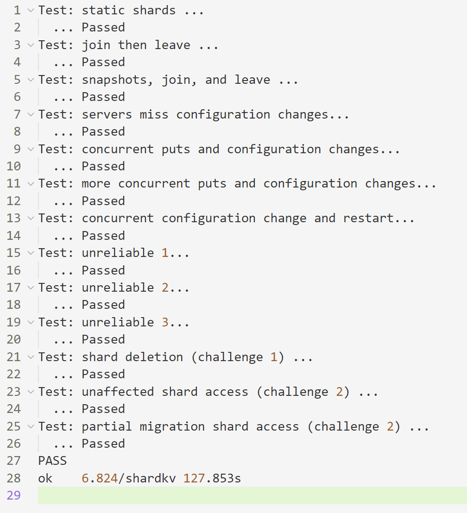
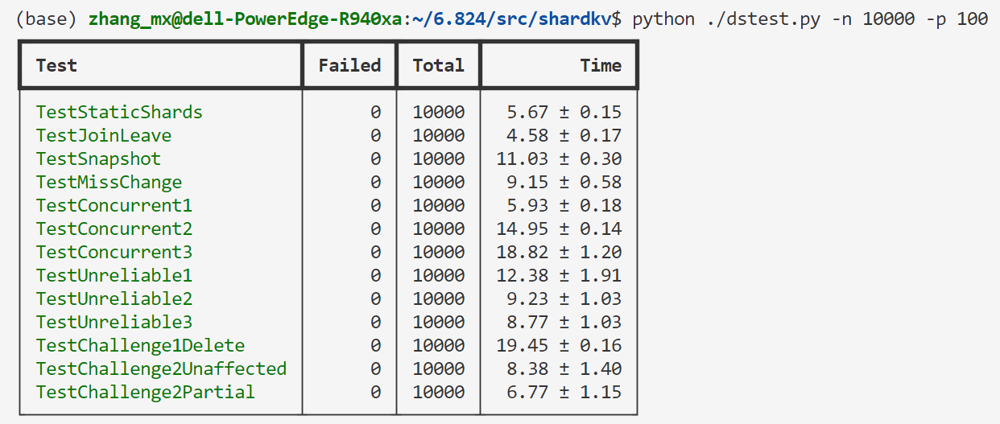

# lab4 Sharded Key/Value Service
lab4需要在lab2和lab3的基础上实现一个分片key/value存储系统，“**分片**”是指一些键值对的集合，是整个键值对的一个子集，例如将key的哈希值对某个数取余，余数为1的key是第一个分片，余数为2的key是第二个分片，...，分片的原因是为了提高系统的性能，将不同分片的key/value存储在不同的副本组上，就可以对这些分片进行并行操作，系统总吞吐量和副本组成比例。

系统由两部分组成，第一部分是一系列的副本组，每个副本组负责一部分分片；第二部分是“**分片控制器**”，该组件负责分片的分配，决定那个副本组来为哪个分片提供服务；分片控制器会随时间推移来改变它的分配方案(称为**配置**)，客户端和副本组都会定期咨询分片控制器来获取最新的配置，客户端通过配置来决定向哪个副本组进行请求，副本组则根据配置来决定向那些分片进行服务。副本组和分片控制器都必须是容错服务，因此都需要使用raft层来保证容错。

系统必须能够在副本组之间**迁移分片**，因为系统可能随时会进行负载均衡来加入新的副本组或者有旧的副本组离开。

lab4分为两部分，4A实现分片控制器，4B实现整个分片key/value存储系统。

## Part A: The Shard controller

分片控制器管理一系列编号的配置，每个配置描述了分片分配情况。当需要更改配置时，管理员（在该lab中是test来担任）通过RPC来通知分片控制器，分片控制器根据命令来生成新的配置；key/value客户端和副本组服务器则会不时向分片控制器查询配置信息。

因此，分片控制器一共需要实现4个RPC接口，Join，Leave，Move和Query。

Join RPC用于修改配置，当管理员需要添加新的副本组时通过该RPC通知分片控制器；Leave RPC也用于修改配置，当管理员需要移除某个副本组时通过该RPC通知分片控制器；Move RPC用于通知分片控制器将某个切片分配给某个副本组，该RPC用于测试；Query RPC用于查询指定编号的配置，管理员和key/value服务的客户端和副本组服务器都可能会调用该RPC。

分片服务器处理这几个RPC的逻辑也较为简单。分片服务器一直维护一个数组**configs**，该数组存储了编号从0开始的所有配置，每当有新的配置生成时就append到该数组中，当需要查询时，则从该数组中获取指定配置。

因此，Query RPC的处理逻辑最为简单，只需要在**configs**中获取指定编号的配置并返回，当查询下标为-1或超出当前的**configs**，返回最后一个配置。Move RPC的处理逻辑也较为简单，Move RPC args中包含要移动的分片和指定的副本组，对于要创建的新配置，我们只需要复制上一个配置，然后将要移动的分片对应的副本组设置为args中指定的副本组，将新配置append到**configs**中。

而Join和Leave的处理逻辑则较为复杂，因为牵扯到rebalance。Join会添加进新的副本组，而Leave会移除一些旧的副本组，因此会导致现有的副本组集合发生变化，我们需要根据现有的副本组集合来进行rebalance。rebalance的原则有两点，一是分片应该尽可能均匀的被分配到当前的副本组中，二是应该移动尽可能少的分片。

因此rebalance的逻辑大概是这样，首先根据Join和Leave传递的参数来更改当前已有的副本组集合，根据上一个配置来统计当前所有副本组的分片分配情况，再统计所有尚未分配的分片（freeShards）。之后为了确保均匀分配，我们计算每个副本组应该分配多少个分片，即Nshards/Ngroups,可能不能整除，因此，会有若干个group会多分配一个分片，我们成为bigGroup。之后我们遍历所有group来分配分片，遍历的顺序如何确定，**我们应该从当前分配分片最多的group开始遍历（在遍历前根据分片多少对groups进行排序），然后将bigGroup都指定为最前面遍历到的groups（将已有分片最多的group指定为bigGroup确保移动的分片一定是最少的）**，对于每个group，如果它现有的分片数目大于指定的数目，那么将多出的分片记为freeShard，如果分片数目少于指定的数目，那么从freeShards中取出分片分配给它。需要注意的是，lab要求了rebalance的代码一定是确定性的，而由于**go语言中的map的遍历是不确定的**，而配置使用map来记录不同group对应的servers的，rebalance中是需要遍历该map来统计当前的副本组集合的，而遍历的顺序是会影响到rebalance的结果的，因此，**我们可以在对group根据分片多少排序前，先根据group的gid进行一次排序**，这样就保证了确定性。

分片控制器需要使用raft来保证容错，关于如何使用在raft后正确对RPC进行返回，这一块的代码可以完全复用lab3中的代码，server在接受client请求后，将命令start到raft层，再创建好通知的channel，applier goroutine 在不断从raft层读取完成共识的命令，当命令真正执行后通过channel来通知RPC handler，再返回RPC。和lab3一样，同样要注意RPC超时的问题和重复请求的问题。

### Test
#### 单次测试



#### 多次测试
并行50个测试，测试5000次


## Part B: Sharded Key/Value Server

Part B需要实现key/value系统的客户端和副本组服务器。

客户端方面其实和lab3中未分片的key/value存储服务的客户端差别不大，并且基本的框架代码已经被给出。和lab3中的差别是，客户端在发起请求前需要根据最新的配置以及key来寻找要请求的副本组，并且在RPC出错后会通过Query RPC向分片控制器查询最新配置。同lab3一样，client也只有Get，Put和Append三种请求。

服务器则比lab3的服务器要复杂的多，有许多新增的功能，需要仔细进行设计。
### 一. 副本组只负责分配给自己的分片

副本组服务器需要增添的**第一个功能就是只对自己负责的分片对应key的请求进行处理**。跟lab3中的服务器不一样，lab4中的服务器并不拥有整个key/value数据库，而是只拥有分配给该副本组的分片对应的key/value，因此它应该只对它拥有的key的请求进行响应。解决方案很简单，服务器会维护当前该副本组已经应用的最新的配置，在接受到Get，Put，Append RPC请求时，它应该首先根据RPC args中的key求出该key对应的分片（shard）（使用lab提供的key2shard()函数），**从当前最新配置中判断该shard是否被分配到了该副本组**，如果是则将对应请求start到raft层等待共识，如果不是则直接返回该RPC，并将reply中的Err置为ErrWrongGroup。那么该判断是否只需要在接受RPC时进行一次呢，答案是否定的，**还需要在命令经过raft层达成共识后被applier读取后真正执行前再判断一次**，因为有这样一种可能，在RPC刚到达服务器时，该shard还属于该副本组，但在命令真正执行时，该副本组已经应用新的配置，不再对该shard负责，因此需要第二次判断，但同时，第一次判断也是不可缺少的，因为第一次判断可以快速拒绝掉服务器不负责的shard的请求，避免无用的命令进入到raft层。

### 二. 副本组配置更新

**第二个功能是实现副本组配置的不断更新。** 管理员会不断通过Join和Leav RPC来使分片控制器生成新的配置，而服务器需要不断查询最新的配置，如果最新配置比当前副本组的配置新，那么需要让整个副本组更新配置。

更新配置的操作需要通过raft层来达成共识，因此，我们除了之前的Get，Put和Append这三种Op， **我们新增一种Op：Update，代表着更新配置的操作。**  查询新配置的任务可以通过一个常驻的loop goroutine来完成，首先需要明确的是查询最新配置只需要由副本组中的leader来负责（follower也无法将更新操作start到raft层），其次，配置的更新必须是连续的，也就是说新配置的编号必须是旧配置编号+1。因此，可以使用这样的一个loop来不断查询新配置。

```go
func (kv *ShardKV) getNextConf() {
	for {
		_, isLeader := kv.rf.GetState()
		kv.mu.Lock()
		if isLeader {
			if kv.commitNewConf <= kv.config.Num {
        // use the kv.config.Num+1 as arg to query the config

        // ...

				if config.Num == kv.config.Num+1 && config.Num > kv.commitNewConf {
					// Start the Update Op with the config

          // if success, update the commitNewConf

          // ...

				}
			}
		}
		kv.mu.Unlock()
		time.Sleep(100 * time.Millisecond)
	}
}
```
该loop不断使用kv.config.Num+1去Query分片控制器来获取下一个配置。但是，如果不加控制的话，在新配置更新成功前，该loop会不断地查询下一个配置，并重复递送到raft层。因此，**可以维护一个kv.commitNewConf，该变量记录了该server已经递送给raft的最后的一个config的编号**，如果该变量大于当前config的编号，那么说明下一个配置已经递送给了raft层，该loop不需要再去查询新配置了，直接sleep。

之后我们考虑Update Op在raft层达成共识后被读取到service层后的处理逻辑。在执行该Op前，我们首先需要确保两件事情：**1.** 该Update Op中的config和kv server当前的config是连续的 **2.** 该kv server当前并不在更新配置。前者只需要判断Op中的config.Num是否等于kv.config.Num+1，对于后者，我们可以维护一个kv.updating的bool型变量，表示当前kv server是否在更新配置，只有在kv.updating为false时才会执行该Op，执行时将该变量置为true，更新完成后将其重新置为false。

这里考虑一下是否有必要确保第二件事情，因为我们在getNextConf中已经使用kv.commitNewConf确保了在更新完成前leader不会再去查找新的配置也不会重复将下一个配置递送给raft层。然而其实是有必要的，因为getNextConf是由leader负责的，但是leader的身份是可能发生变化的，假如server 1在担任leader时将config N递送给raft层后失去leader身份，而server 2担任新的leader后再次将config N递送到raft层，那么就有可能在执行更新过程中再次执行更新操作，导致更新出错。

那么当真正执行Update Op时，应该如何进行。首先需要明确的一件事是，**我们的配置更新过程不应该是一个原子的过程，而是一个渐进的过程**，也就是说，在配置更新过程中，我们并不是直接停止所有服务，等待分片交换完成后再开放服务，而是在更新中分片交换的过程中仍然为尽可能多的分片提供服务，具体表现为，**1.对于在新配置和旧配置中并未改变副本组的分片，那么该分片应该始终被提供服务；2.对于被从旧副本组移动到新副本组的某个分片，一旦当该分片被迁移到新副本组上时就应该被提供服务，而不是等待整个新配置更新完成后才提供服务。** 这两点要求其实也就是lab4的No-credit challenge2中的要求。因为更新过程是渐进的，因此kv server拥有的配置其实是有中间态的，我们可以直接在kv.config上进行修改，在为分片提供服务时也根据实时更改的kv.config来决定是否拒绝服务，并且用kv.newConfig记录下新的配置，当更新完成后，我们才将kv.newConfig赋值给kv.config，完成更新。

在配置更新过程中，对于一个group来说，分片可以分为三种，第一种是在新配置和旧配置中都不属于该group的分片，第二种是更新后该group失去的分片，第三种是更新后该group获得的分片。对于第一种分片，它们与该group无关，因此直接将按照新配置的分配结果修改kv.config。对于第二种分片，该group立刻放弃对该分片的服务，并把该分片标记为待迁移（将kv.config中对应的gid设置为非法值-1）。对于第三种分片，由于group尚未获得对应的分片，还无法提供服务，因此先不做处理，等待后面的分片迁移处理逻辑去获取对应的分片。

```go
func (kv *ShardKV) updateConf(newConfig *shardctrler.Config) {
	kv.newConfig = *newConfig
	kv.updating = true
	for i := 0; i < shardctrler.NShards; i++ {
		if newConfig.Shards[i] != kv.gid && kv.config.Shards[i] == kv.gid {
			// the shard is moved to other group
			kv.config.Shards[i] = -1 // means this shard need to push to other group
		} else if kv.config.Shards[i] == 0 && newConfig.Shards[i] == kv.gid {
			kv.config.Shards[i] = kv.gid
		} else if kv.config.Shards[i] != kv.gid && newConfig.Shards[i] != kv.gid {
			kv.config.Shards[i] = newConfig.Shards[i]
		}
	}
}
```

### 三. 分片迁移

**第三个需要是实现的功能是分片迁移。** 上面的配置更新逻辑只是将当前配置修改为中间态，只有将分片迁移完成后才能真正完成配置的更新。

首先需要考虑的是分片迁移需要交换的数据有什么。**毫无疑问首先要交换的是分片对应的key/value，只有将分片对应的key/value的最新状态迁移到新的group上，新的group才能无错的继续为分片提供服务**。在交换时我们可以不将整个key/value的map发送，而是只将分片对应的key/value的集合发送。还需要交换什么呢？试想一下，如果一个客户端在分片迁移前向就group进行了Append操作，该操作成功执行了但由于一些意外RPC未成功返回，分片迁移之后，客户端尝试向新group重试Append操作，那么新group是否该拒绝该操作呢，如果不拒绝，Append两次一定会造成错误，如果拒绝，但是新Group又确实没有收到过该命令，无法判断它是一个重复操作。**解决办法是，在分片迁移时，将用于命名去重的kv.lastCmdIds一并发送，新Group收到后用它来更新自己的kv.lastCmdIds。**

其次要考虑的是分片迁移的协议是怎样的。可以采取的协议有两种，一种是新group向旧group pull分片，**另一种是旧group主动向新group push分片**。这里采取第二种协议比较简单，每个group都可以根据kv.newConfig知道每个分片应该被迁移到哪个group，直接发送就好。

需要设计一个新的RPC PushShard来完成分片迁移。该RPC的调用时机就是在配置更新开始后，旧group可以开启多个goroutine分别将多个分片发送到对应的新group，那么是否所有的kv server都需要负责该任务呢，答案是只需要leader来完成，针对同一个分片进行多次PushShard的调用是浪费的。该任务同样可以用一个常驻的loop goroutine来实现：
```go
func (kv *ShardKV) pushAllShards() {
	for {
		_, isLeader := kv.rf.GetState()
		if isLeader {
			var wg sync.WaitGroup
			kv.mu.Lock()
			newConfigNum := kv.newConfig.Num
			if kv.updating && kv.pushFinish < newConfig.Num {
        // for all shards than should be moved to new group
        // go kv.callPushShard(args,reply) and wg.Add(1)
        // ...
        wg.Wait()
        kv.pushFinish = newConfigNum
      }
			kv.mu.Unlock()
		}
		time.Sleep(100 * time.Millisecond)
	}
}
```
kv.pushFinish变量记录了当前该kv server已经完成所有push的配置编号，由于leader身份会转移，因此该变量的变化不一定是连续的，但一定是递增的，当kv.pushFinish < newConfig.Num时，说明当前待更新的配置还未push完成，开始启动多个goroutine来向对应的新group发送分片，这里使用WaitGroup等待所有线程完成后更新kv.pushFinish。

**对应分片的迁移操作我们同样需要通过raft层来完成共识，因此这里再新添一种Op: Push,代表着分片的push操作。** PushShard RPC的handler会将Push操作Start到raft层，等待达成共识后，service层再次读取到操作，开始真正执行。

执行的逻辑也较为简单，在判断完push来的分片对应的配置编号和当前该 server正在更新的配置编号一致时并且kv.updating为true时，开始合并push来的key/value以及LastCmdIds，完成后，修改处于中间态的kv.config，将对应shard的gid标记为kv.gid，标志着该分片迁移完成，该group也可以开始向该分片提供服务了。

### 四.更新完成和GC

在一个group将所有不再负责的分片push完后并且收到了所有新的分片的push之后，该group就已经完成了该轮配置更新的所有实际工作，**但还需要有一个明确的更新完成操作来修改一些状态变量使得可以开始更新新的配置并且完成垃圾回收任务。** 这里的垃圾回收是指当一个group将不再负责的分片push出去之后，它不再需要这些分片对应的key/value，因此可以从数据库中清除这些key/value对。但是对key/value的清除必须小心，必须保证分片已经完整迁移到新的group后才能进行，否则会造成数据的丢失。因此，一个比较合适的时机就是在更新完成后进行。

配置更新操作同样需要通过raft层来达成共识，因此，**再新添一种Op: Done,代表着配置更新完成操作。** 我们同样通过一个常驻的loop goroutine来判断一轮配置更新是否完成，该任务同样只由leader负责：

```go
func (kv *ShardKV) checkUpdateFinish() {
	for {
		_, isLeader := kv.rf.GetState()
		kv.mu.Lock()
		if isLeader && kv.commitDone < kv.newConfig.Num && kv.updating {
			if kv.pushFinish == kv.newConfig.Num {

				updateFinish := true
				for i := 0; i < shardctrler.NShards; i++ {
					if kv.newConfig.Shards[i] == kv.gid && kv.config.Shards[i] != kv.gid {
						updateFinish = false
						break
					}
				}
				if updateFinish {
          // start the done op and update kv.commitDone
				}
			}

		}
		kv.mu.Unlock()
		time.Sleep(100 * time.Millisecond)
	}
}
```
该loop会不断检查当前更新的config的分片push是否完成，如果完成了也就是kv.pushFinish == kv.newConfig.Num，那么再去检查别的group是否已经将分片push到该group，如果都完成了那么说明更新已经完成了，loop将Done Op start到raft层。

该loop和getNextConfig会存在同样的问题，如果不进行控制的话，loop会在新配置到达前不断地将本轮配置更新的Done Op递送给raft层，因此我们维护一个kv.commitDone变量，该变量记录了该server递送给raft的最后一个Done操作的配置编号，只有当kv.commitDone < kv.newConfig.Num时，说明该newConfig对应的Done Op还未被递送过，才会去递送该Op到raft层。

当Done Op被service层读取到后，开始真正执行相关的操作。Done操作需要更新kv.config，同时将kv.updating置为false，表示该轮配置更新彻底完成，最后进行垃圾回收，也就是将不需要的key/value从数据库中删除：

```go
  kv.config = kv.newConfig
  kv.updating = false
  deleteKeys := make([]string, 0)
  for key := range kv.kvMap {
    shard := key2shard(key)
    if kv.config.Shards[shard] != kv.gid {
      deleteKeys = append(deleteKeys, key)
    }
  }
  for _, key := range deleteKeys {
    delete(kv.kvMap, key)
  }
```

## 出现的bug

### bug1
**bug1发生的原因是由于未对push分片请求进行去重导致的。** 在lab3中提到了，客户端对服务器的Put，Append操作需要进行去重，防止相同的命令执行多次，而在lab4中，当group1向group2进行push分片时，group1可以看做是一种特殊的客户端，group1可能在第一次push时，group2成功执行了但是RCP返回失败了，group1再次尝试发送同样的push请求，group2重复执行两次相同的push Op，导致分片迁移出错。因此，有必要也对push请求进行去重，去重方法很简单，可以在**每个kv server中维护一个数组 pullShardsMap [shardctrler.NShards]int，该数组的第i个元素记录了该server最后一次接收分片i的push请求对应的配置Num，当有第i个分片的push请求到达时，只有当该请求的配置Num大于pullShardsMap[i]时才会接收该请求，否则拒绝。** 在成功执行一次Push Op后更新该数组的对应元素。

### bug2
**bug2出现的原因是对于Get请求的处理逻辑出现问题。** lab4中很多代码是直接复用lab3中的代码，对于Get请求的处理部分也是沿用了lab3中的处理方法。

在lab3中，当Get RPC到达时，handler将Get Op start到raft层并建立好用于通知的channel，等待Op真正执行，raft完成共识后，service层的applier读取到该Op进行apply，并不进行任何操作而是直接向channel进行通知，RPC handler在channel上得到通知后，再去key/value的数据库通过Get请求的key进行value的查询，然后返回RPC。

这套处理流程看似没有什么问题，在lab3的测试中也未出现问题，**但在lab4中实际上有潜在的风险，原因是Get Op的apply和在数据库中的查询操作并不是一个原子的过程**，从applier将通知写入channle后，再到RPC handler读取通知去数据库查询，这两个操作之间，数据库的状态可能已经发生了变化。

在lab3中是不会出现这样的问题的，因此唯一的副本组拥有整个数据库，并且对于同一个key值，在Get请求返回前是不会有其他请求到达来修改数据库状态的。但是在lab4中，存在这样一种情况，**Get Op在被apply时，对应的分片还属于该group，因此group并没有拒绝该Op，并且通知了该Op对应的channel，RPC handler得到通知后去数据库中进行查询，但恰好，在写入通知和得到通知之间的一段时间内，该group在进行配置更新并且刚好失去了该分片并从数据库中删除了对应的key/value对，那么RPC handler在查询时只能查到空值，向客户端返回了错误的value。**

解决办法其实也很简单，就是使Get Op的apply操作和查询操作是原子的，**在applier apply Get Op时，同时在数据库中进行value的查询，将查询结果一起写入到channle中，RPC handler从channel中读取到通知的同时也读取到了查询结果，将查询结果作为RPC 返回的reply。** 其实在lab3中也考虑过这种设计，但当时觉得在channle中多传递一个字段有些浪费，才决定在RPC handler中进行实际的查询操作。
applier关于Get Op的大致代码：
```go
func (kv *ShardKV) applier() {
	for {
		newApplyMsg := <-kv.applyCh
		if newApplyMsg.CommandValid {
			op := newApplyMsg.Command.(Op)
      index := newApplyMsg.CommandIndex
      // other Op
      // ...
      if op.Op == op_get {
        kv.lastCmdIds[op.ClientId] = op.CmdId
        if ch, ok := kv.notifyChs[index]; ok {
          ch <- CmdIdentify{ClientId: op.ClientId, CmdId: op.CmdId, Err: OK, Result: kv.kvMap[op.Key]}
        }
      }
    }
  }
}
```
### bug3

bug3是整个6.824中de的最恶心的一个bug，排查的时间也是最长的。

bug3出现在TestChallenge2Unaffected这个测试用例中，出现的概率也不是很高，大概千分之一的概率。

首先说明一下TestChallenge2Unaffected这个测试用例，简单来说，该测试中一共有3个Group，G1，G2，G3，首先将G1 join进来，这样分片控制器会在配置1中将所有分片都分配给G1，然后put一些key/value对，这些key覆盖多个分片；之后再将G2 join进来，等待一秒，等待配置2形成，配置2会将G1一部分分片迁移到G2上，之后测试会不断向属于G2的分片的key/value进行操作，并在过程中shutdown掉G1并leave掉G1，测试会查看对属于G2分片的key/value的操作在G1 leave前后是否受到了影响。整个测试过程是在网络不可靠的情况下进行的。

该用例主要是为了测试在配置更改期间，是否能够继续对未受影响分片中的key进行客户端操作，也就是challenge2中的部分要求。最开始发现该测试有概率不能通过时，我以为是分片迁移策略有问题不能满足challenge2的要求，检查后感觉分片迁移应该没啥问题。之后去捕获失败测试的log，发现了问题所在，在失败的测试里，无一例外都是因为，**在G2被join进来后到G1被kill前这一秒多（等待一秒后再进行一些put操作，加起来1.2s左右）内G1并未成功获取配置2，导致G1在被kill前还未将分片迁移给G2，G2没有拿到属于自己的分片，客户端在依据配置2向G2进行请求全部被拒绝。**

那么为什么会导致这样的情况呢，我试过将测试代码里的等待时间从一秒增加到两秒后，测试5000次不会出错，那么一定是因为整个过程中的某些步骤的性能不够。是分片控制器形成新配置的速度不够快吗，应该不是，分片控制器生成新配置的逻辑很简单，执行速度应该在毫秒级别。那么是kvserver获取新配置的频率不够快吗，按照lab4的描述，这个loop的执行频率每100ms一次应该就足够了，我试着把频率改成10ms一次，情况也没有改善，应该不是这里的问题。到这里，我开始怀疑是不是raft层的性能有问题。是由于raft apply log的速度不够快吗，最开始实现raft是通过常驻goroutine loop来实现的，通过条件变量改成触发式的，apply的速度有所上升，但是测试还是有概率出错。

de到这里实在是不知道问题还可能在哪，后来的后来，才发现了问题所在，由于lab4一直在复用lab3的代码，分片控制器的server部分的代码也复用了lab3的，包括RPC超时部分，在lab3中，超时时间被设置为500ms，在lab3中并没有像
TestChallenge2Unaffected这样的测试用例要求1s后一定要某个事件达成共识，因此测试过程中也没有发生什么问题。**但是在这个lab4这个测试用例中，如果还将分片控制器的RPC超时设置为500ms，在配置2生成后，G1向分片控制器查询配置时恰好Query RPC发生了一次或者超时，那么在一秒多内，G1是非常有可能不能获取到配置2的，这也就导致了bug的出现。**

解决办法很简单，将分片控制器的RPC超时设置小一点，设置太小也不合适，150ms是一个比较合适的数字。de了两三天的bug只需要修改一个数字就好。。。

### Test
#### 单次测试



#### 多次测试

自己电脑上测试的话并行数开不了太高，直接在实验室服务器上测试，一次并行100个测试，多测点，测10000次

